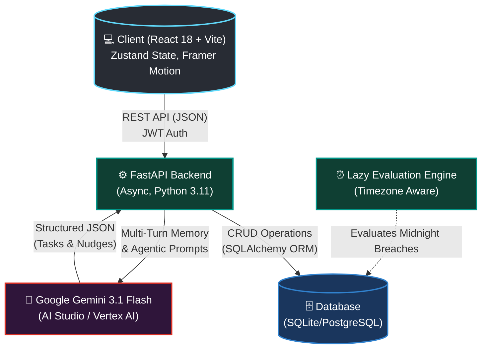

<div align="center">


# 🔥 StreakForge

**An AI-Powered Productivity Ecosystem built for the "Last-Minute Life Saver" Hackathon.**

[](https://reactjs.org/)
[](https://fastapi.tiangolo.com/)
[](https://deepmind.google/technologies/gemini/)
[](https://www.docker.com/)

> *"Users don't lack memory—they lack accountability. StreakForge fixes human procrastination by combining autonomous AI planning with the psychological power of Loss Aversion."*

</div>

---

## ⚡ Why StreakForge? (The Innovation)

Most productivity tools are passive. You set a task, and you ignore the reminder. 
**StreakForge is Proactive & High-Stakes.** 

1. **The Accountability Court:** Stake your hard-earned virtual XP/Coins on critical tasks. If you miss the midnight deadline, your smart contract breaches and you lose your progress.
2. **Deep Agentic AI:** Speak to your AI Copilot. It doesn't just chat—it autonomously parses your goals, estimates time, creates a schedule, and **injects the tasks directly into your PostgreSQL database.**

---

## 🏗️ System Architecture

GitHub renders the diagram below dynamically to showcase our decoupled, scalable architecture.



---

## 🔮 Core Agentic Capabilities

| Feature | Description | Google Tech Used |
| :--- | :--- | :--- |
| **Autonomous Planning** | Users prompt the AI to plan their day. The AI breaks down tasks, assigns priorities, and injects them straight into the UI/DB. | `Gemini 3.1 Flash Lite` |
| **Risk Predictor** | Machine learning analyzes historical completion rates. If a user is at risk of breaking a streak, the AI generates a proactive nudge. | `Gemini Data Processing` |
| **Voice Copilot** | Users can interact with the AI completely hands-free using real-time voice transcription. | `Web Speech API` |

---

## 📂 Project Structure

```text
📦 streakforge
 ┣ 📂 backend/               # FastAPI Application
 ┃ ┣ 📂 app/
 ┃ ┃ ┣ 📂 api/               # REST API endpoints (Routers)
 ┃ ┃ ┣ 📂 core/              # Security, JWT, Database Config
 ┃ ┃ ┣ 📂 ml/                # Risk Prediction Logic
 ┃ ┃ ┣ 📂 models/            # SQLAlchemy Database Schemas
 ┃ ┃ ┗ 📂 services/          # Core Business Logic & AI Integrations
 ┃ ┣ 📜 Dockerfile           # Multi-stage build for Cloud Run
 ┃ ┗ 📜 requirements.txt
 ┣ 📂 frontend/              # React 18 SPA
 ┃ ┣ 📂 src/
 ┃ ┃ ┣ 📂 components/        # Reusable UI components & AI Copilot Widget
 ┃ ┃ ┣ 📂 store/             # Zustand State Management
 ┃ ┃ ┗ 📂 services/          # Axios API clients
 ┃ ┗ 📜 package.json
 ┗ 📜 README.md
```

---

## 🚀 Quick Start Guide

### 1. Boot the API (Backend)
```bash
cd backend
python -m venv venv
source venv/bin/activate
pip install -r requirements.txt

# Add GEMINI_API_KEY to your .env file
uvicorn app.main:app --reload --port 8000
```

### 2. Boot the Client (Frontend)
```bash
cd frontend
npm install
npm run dev
```
Navigate to `http://localhost:5173`.

---

<div align="center">
  <h3>✨ Built for the Hackathon ✨</h3>
  <p>Ready for production deployment on Google Cloud Run.</p>
</div>
