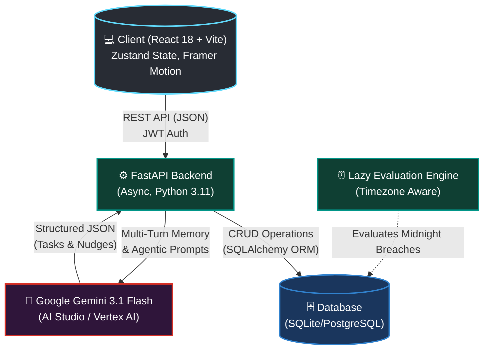

<div align="center">


# 🔥 StreakForge

**An AI-Powered Productivity Ecosystem engineered to defeat procrastination.**

[](https://reactjs.org/)
[](https://fastapi.tiangolo.com/)
[](https://deepmind.google/technologies/gemini/)
[](https://www.docker.com/)

> *"Users don't lack memory—they lack accountability. StreakForge fixes human procrastination by combining autonomous AI planning with the psychological power of Loss Aversion."*

</div>

---

## 📖 Table of Contents
1. [The Psychological Theory (Why it works)](#the-psychological-theory-why-it-works)
2. [The Agentic AI Workflow](#the-agentic-ai-workflow)
3. [UI/UX Philosophy](#uiux-philosophy)
4. [System Architecture](#system-architecture)
5. [Project Structure](#project-structure)
6. [Quick Start Guide](#quick-start-guide)

---

## 🧠 The Psychological Theory (Why it works)

Most productivity tools fail because they are fundamentally flawed: they act as passive repositories. When a notification reminds a user to study, the easiest action is to simply swipe it away. There is no consequence.

StreakForge is built on the proven behavioral psychology concept of **Loss Aversion**—the psychological principle that the pain of losing something is twice as powerful as the pleasure of gaining it.

### The Accountability Court
We digitized Loss Aversion through our "Accountability Court." 
- When you create a high-priority task, you **pledge your virtual currency (coins & XP)** on it.
- This creates a **Smart Contract**. If you fail to complete the task before the midnight deadline (computed strictly on your local timezone), the contract breaches.
- You lose your hard-earned progress. 

By tying real psychological stakes to daily habits, StreakForge transforms procrastination from a harmless habit into an immediate, painful loss, forcing users to take **meaningful action**.

---

## 🤖 The Agentic AI Workflow

StreakForge doesn't just use AI as a generic chatbot; it utilizes **Deep Agentic Workflows** powered by **Google Gemini 3.1 Flash Lite**. The AI is an active participant in the application's ecosystem.

1. **Autonomous Database Injection:** Instead of just giving advice, the AI Copilot takes action. If a user says, *"Help me prepare for my exams next week"*, the AI autonomously breaks down the goal, estimates time, assigns priorities, and outputs a strict JSON payload that the FastAPI backend parses to **inject tasks directly into the user's database.**
2. **Context-Aware Risk Prediction:** The AI engine acts as a silent guardian. It constantly analyzes a user's historical task completion rates and streak patterns. If the model detects a statistical probability that the user will break their streak today, it triggers a proactive, personalized nudge *before* failure occurs.
3. **Multi-Persona Routing:** The AI detects context. A coding task routes to *The Compiler* (technical mentor), while a workout routes to *The Coach*, dynamically altering system prompts to provide hyper-relevant guidance.

---

## 🎨 UI/UX Philosophy

A productivity app that is too complex will cause users to abandon it. We designed StreakForge around the principle of **Progressive Disclosure**.

- **Cognitive Overload Prevention:** Advanced analytics (GitHub-style Contribution Heatmaps, multi-axis Mood Trackers, XP progression curves, and AI recommendations) are neatly tucked away behind smooth, collapsible interfaces.
- **Visual Hierarchy:** When a user opens the dashboard, 90% of the screen focuses purely on their **Immediate Next Action**. High-contrast Ember & Green gradients draw the eye exclusively to the "Start" buttons.

---

## 🏗️ System Architecture

Our decoupled, scalable architecture ensures lightning-fast AI interactions and robust state management.



---

## 📂 Project Structure

```text
📦 streakforge
 ┣ 📂 backend/               # FastAPI Application
 ┃ ┣ 📂 app/
 ┃ ┃ ┣ 📂 api/               # REST API endpoints (Routers)
 ┃ ┃ ┣ 📂 core/              # Security, JWT, Database Config
 ┃ ┃ ┣ 📂 ml/                # Risk Prediction Logic
 ┃ ┃ ┣ 📂 models/            # SQLAlchemy Database Schemas
 ┃ ┃ ┗ 📂 services/          # Core Business Logic & AI Integrations
 ┃ ┣ 📜 Dockerfile           # Multi-stage build for Cloud Run
 ┃ ┗ 📜 requirements.txt
 ┣ 📂 frontend/              # React 18 SPA
 ┃ ┣ 📂 src/
 ┃ ┃ ┣ 📂 components/        # Reusable UI components & AI Copilot Widget
 ┃ ┃ ┣ 📂 store/             # Zustand State Management
 ┃ ┃ ┗ 📂 services/          # Axios API clients
 ┃ ┗ 📜 package.json
 ┗ 📜 README.md
```

---

## 🚀 Quick Start Guide

### 1. Boot the API (Backend)
```bash
cd backend
python -m venv venv
source venv/bin/activate
pip install -r requirements.txt

# Add GEMINI_API_KEY to your .env file
uvicorn app.main:app --reload --port 8000
```

### 2. Boot the Client (Frontend)
```bash
cd frontend
npm install
npm run dev
```
Navigate to `http://localhost:5173`.

---

<div align="center">
  <h3>✨ StreakForge ✨</h3>
  <p>Ready for production deployment on Google Cloud Run.</p>
</div>
