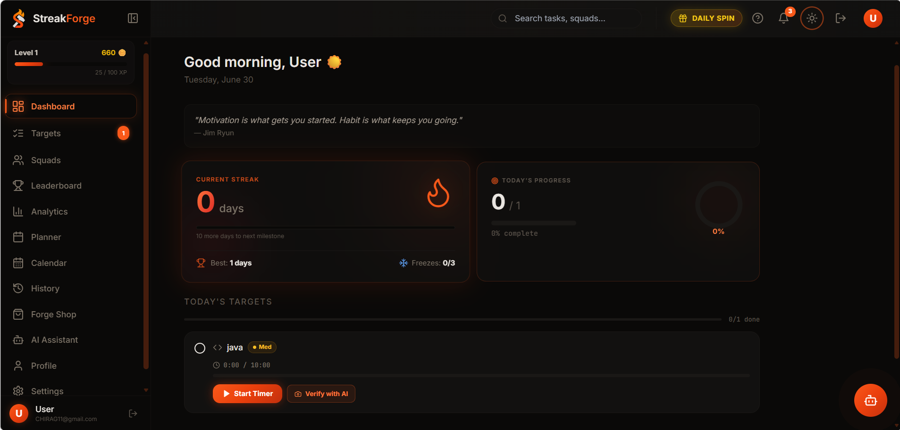
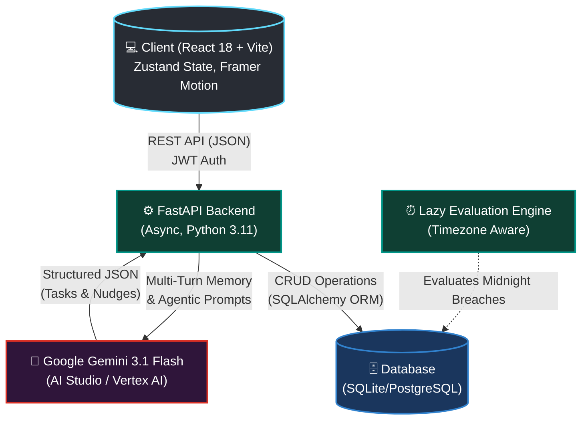

<div align="center">
  
  <h1>StreakForge</h1>
  <p><strong>An AI-Powered Productivity Ecosystem engineered to defeat procrastination.</strong></p>

  <p>
    <a href="https://reactjs.org/"></a>
    <a href="https://fastapi.tiangolo.com/"></a>
    <a href="https://deepmind.google/technologies/gemini/"></a>
    <a href="https://www.docker.com/"></a>
    <a href="LICENSE"></a>
  </p>
</div>

---

## 📝 About The Project

Traditional productivity apps rely on passive notifications that are easy to ignore. **StreakForge** changes the game by introducing **High-Stakes Gamification** and an **Agentic AI Copilot**. 

You don't just create tasks; you pledge virtual coins on them. If you miss your midnight deadline, you suffer a "Contract Breach" and lose your progress. To help you succeed, an onboard Google Gemini AI Copilot acts as your 24/7 mentor—capable of listening via voice, generating structured study/work plans, and autonomously injecting those tasks into your daily schedule.

<!-- 

*(Tip: Add a screenshot of your dashboard here later!)* 
-->

---

## ✨ Features

- 🤖 **Autonomous AI Copilot:** Chat (text/voice) with an AI that doesn't just talk, but actually creates and schedules tasks directly into your database.
- ⚖️ **Accountability Court:** Stake your virtual currency on high-priority goals. Lose it if you fail to complete the task by midnight.
- 🔮 **Context-Aware Risk Predictor:** Machine learning analyzes your history and warns you before you break a streak.
- 📊 **Progressive Disclosure UI:** GitHub-style heatmaps, mood tracking, and deep analytics hidden behind a clean, distraction-free interface.
- 🗣️ **Voice-Enabled:** Hands-free interaction powered by the Web Speech API.

---

## 🏗️ System Architecture



---

## 💻 Tech Stack

- **Frontend:** React 18, TypeScript, Vite, Tailwind CSS, Zustand, Framer Motion
- **Backend:** Python 3.11, FastAPI (Async), SQLAlchemy, SQLite/PostgreSQL
- **AI/ML:** Google Gemini 3.1 Flash Lite (via Vertex AI / AI Studio)
- **Deployment:** Docker, optimized for Google Cloud Run / Railway

---

## 🚀 Getting Started

Follow these steps to set up the project locally on your machine.

### Prerequisites

- Python 3.11 or higher
- Node.js 18 or higher
- A Google Gemini API Key

### Installation

1. **Clone the repository**
   ```sh
   git clone https://github.com/yourusername/streakforge.git
   cd streakforge
   ```

2. **Setup the Backend**
   ```sh
   cd backend
   python -m venv venv
   source venv/bin/activate  # On Windows: venv\Scripts\activate
   pip install -r requirements.txt
   
   # Set up environment variables
   cp .env.example .env
   # Add your GEMINI_API_KEY to the .env file
   
   # Run the FastAPI server
   uvicorn app.main:app --reload --port 8000
   ```

3. **Setup the Frontend**
   ```sh
   cd ../frontend
   npm install
   
   # Connect to local backend
   echo "VITE_API_URL=http://localhost:8000/api" > .env.local
   
   # Start the development server
   npm run dev
   ```

4. **Open the App**
   Navigate to `http://localhost:5173` in your browser.

---

## 🐳 Docker Deployment

StreakForge includes a multi-stage Dockerfile that builds the React frontend and serves it statically via the FastAPI backend, making it incredibly easy to deploy as a single container.

```sh
docker build -t streakforge .
docker run -p 8000:8000 --env-file backend/.env streakforge
```

---

## 🤝 Contributing

Contributions, issues, and feature requests are welcome! 
Feel free to check [issues page](https://github.com/yourusername/streakforge/issues).

## 📄 License

This project is licensed under the MIT License - see the [LICENSE](LICENSE) file for details.
